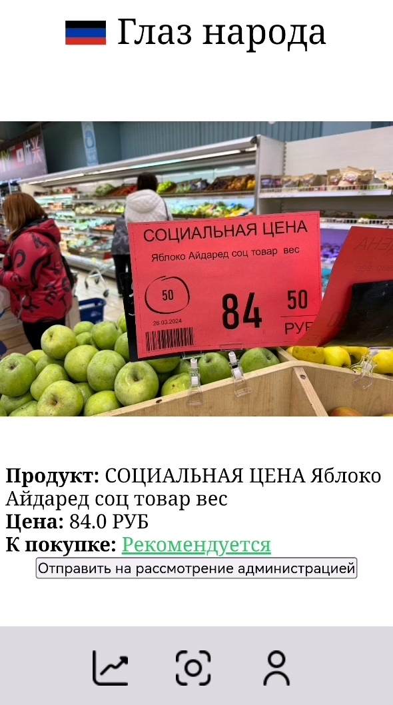

# Глаз народа
Удобный инструмент анализа цен Донецкой Народной Республики

# Как пользоваться

1. Установите следующие библиотеки, которые нужны для запуска кода:
```
pip install flask pandas flask_session werkzeug ultralytics easyocr openpyxl
```
2. Запустите app.py
3. Сайт также доступен по [ссылке](https://e91f-92-255-142-79.ngrok-free.app)


# Пользовательский интерфейс
## Вход


## Результат обработки ценника
